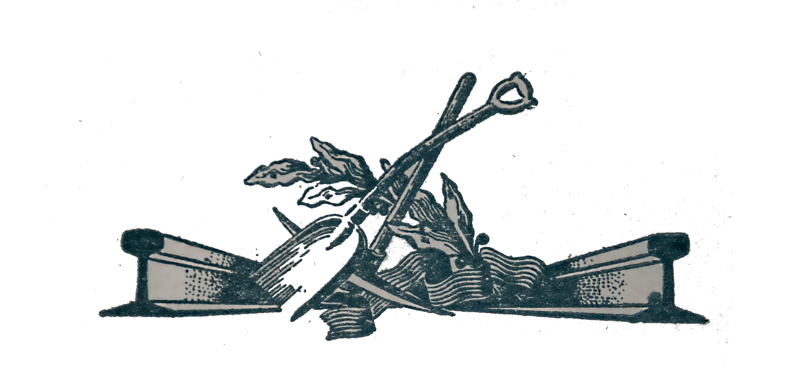
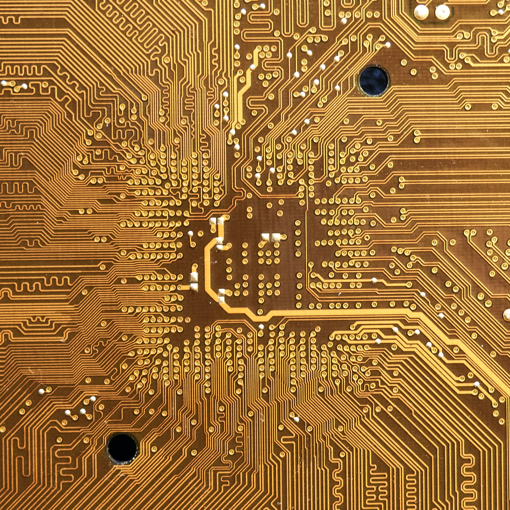

<center> <b>Caveat Emptor! Work in Progress</b> </center>



> In IT systems in general, the programming language is not of primary importance. Architecture is.
>
> IT system (not your desktop experiments) is made of components. Each component has a well-defined interface and set of operational requirements. E.g. size, speed, security, and such. If your component does meet operational requirements I really do not care if you have written it in Quick Basic, Julia, Rust, Elm, Awk, Bash Script or C++.
>
> Just after that, it will be rigorously tested for meeting the functional requirements and operational requirements.
>
> Also please do not (ever) forget the economy of IT systems: how much money will it take to develop it and more importantly how much money will it take to maintain what you did, and for the next 10+ years.

&copy; 2020 - 2021 by dbj at dbj dot org


# DBJ COMPONENT SYSTEM&trade; aka DBJCS

Why are today's component systems so complex, and difficult to use? Behind that very pompous name is attempt to architect and implement the simplest possible component system.

> Using only [standard C](http://www.open-std.org/jtc1/sc22/wg14/www/standards.html#9899) and Windows DLL. 

If some "feature" is missing we can always pull the card of simplicity as an excuse. Let us see how far can we get.

## How is this working?

- one DBJ Component is one DLL
- one component has one C struct that represents an interface that has one implementation
- All DBJ Components (DLLs) have the same def file. 
  - This is it:
```
EXPORTS
dbj_component_can_unload_now      PRIVATE
interface_factory             PRIVATE
dbj_component_version             PRIVATE
```
- thus each DBJ Component exports all of the three functions above
- each component header has to have one string literal
  1. The component dll file name
```cpp
// component_a.h
#define COMPONENT_A_DLL_NAME "component_a.dll"
```
 - The component factory function name is always the name
     - `"interface_factory"`
     - that is the name (as exported) not the full function signature of the factory function
- that is enough information to runtime load the dll (aka component) and get to the factory function `void *`
  - that is not enough to execute it yet
- factory function returns a pointer to the single implementation of the component interface (a C struct)
```cpp
// from component_a.h
// factory function declaration is not required
// it is just implied
// struct component_a * interface_factory(void);
``` 
  - that interface is a struct and is the only thing required to de declared in the component header for users to use.
```cpp
// component_a.h
struct component_a {
  // data 
    int data_;
  // function pointers
    int (*get42)(struct component_a *);
};
```
For the factory function from a DLL aka "component" to be executed we need a function pointer that matches the  footprint of the factory function. Thus we do not need the factory function declaration.

Again. Factory function does not have to be declared. It is defined by name in the `.def` file of the component and its full foot print is only implied. Allwe need is the factory function pointer so that we can use it after we load the component dll.
```cpp
// component_a.h
// factory function pointer declaration is required
typedef struct component_a * (component_a_factory_fp)(void);
```
### Let us clarify. 

`dbj-component-loader.h` contains a macro that does it  all.  It allows user of dbj componet to code a callback that will receive a factory function pointer.
```cpp
#define DBJCS_CALL(
dll_name_, 
fun_name_, 
RFP,          // the factory function pointer 
callback_)    // the callback where it is used   
```
Synopsis of its core explains succinctly the workings of DBJCS:

```cpp
// try and load the dll
dbjcapi_dll_load(dll_name_);
// get to the function first
// cast the result to the required function pointer
RFP function_ = (RFP)dbjcs_dll_get_function(fun_name_); 
// if function is found call the callback
// with it as a argument
if (function_)            
      callback_(function_);
// immediately "unload" the dll      
// Windows keeps it in a memory for a while
dbjcs_dll_unload();
```
Example: On the struct interface of the `component_a.dll` declared is a function pointer `get42` . The struct interface is declared like this:
```cpp
// component_a.h
struct component_a
{
    int data_;
    int (*get42)(struct component_a *);
};
```
Let us call that `get42` :

- dll name
  - `"component_a.dll"`
- factory function name; always the same
  - `"interface_factory"`
- factory function pointer of the exact component
  - `component_a_factory_fp` declared in `"component_a.h"`
  - the callback where user will do the job
```cpp
void use_component_a ( component_a_factory_fp factory_) ;

 // execute the load and call the callback
DBJCS_CALL( 
  "component_a.dll",
 "interface_factory", 
 component_a_factory_fp,
  use_component_a
 ) ;

 void use_component_a ( component_a_factory_fp factory_) 
{
  // get to the implementation instance
  struct component_a * implementation = factory_() ;
  
  // call function declared on it
  int  rezult = implementation->get42(implementation*);
}
// if any, dll loader failures are already logged
```


## The Roadmap

- Currently no UUID is really necessary
- no central "entity" to (for example) deliver implementations etc. 
- If using anything from Windows for components do not go above `rpc.h` 

## The History 
  - First came OLE
    - OLE was invented for MS Office integration
  - COM and OLE are two separate "things"
    - COM was also first used just in Office
  - COM 1.0 was released 1993 
    - The period when OOA/OOD/OOP where thought to be the "Final Solution"
  - COM is based on MSRPC
    - MSRPC is the DEC IPC implementation
    - The very foundation of Windows NT
  - COM is now a legacy and it is a problem
    - COM works just because of millions (or more?) man hours invested in it 
  - .NET components (aks "Assemblies") and COM components are two separate "things"
    - different architecture and different implementation

---

&copy; 2021 by dbj@dbj.org

https://dbj.org/license_dbj 
